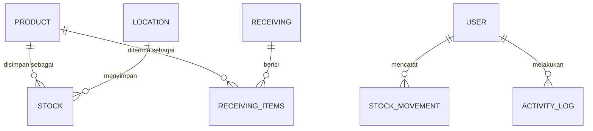

# ERD WMS GUDANG ACC

Relasi inti antar tabel master & transaksi.

```
PRODUCT
  |
  |
STOCK
  |
  |
LOCATION


PRODUCT
  |
  |
RECEIVING_ITEMS
  |
  |
RECEIVING


USER
  |
  |
STOCK_MOVEMENT


USER
  |
  |
ACTIVITY_LOG
```

## Kardinalitas

```
1 Product
     |
     |
Many Stock


1 Location
     |
     |
Many Stock


1 User
     |
     |
Many Transaction
```

Satu Produk bisa tersimpan di banyak baris Stock (satu per Lokasi), dan satu Lokasi bisa menyimpan banyak baris Stock (satu per Produk) — sesuai constraint `UNIQUE (product_id, location_id)` di tabel `stocks`. Satu User bisa punya banyak Transaction (dipetakan ke tabel `stock_movements`, tiap baris mutasi stok tercatat atas satu `user_id`).

## Diagram



## Pemetaan ke tabel database

| Entitas ERD | Tabel | Keterangan |
|---|---|---|
| PRODUCT | `products` | Master Product |
| LOCATION | `locations` | Master Location |
| STOCK | `stocks` | Master Stock (`product_id`, `location_id`, `qty`, `available_qty`) |
| RECEIVING | `receiving_headers` | Header penerimaan barang |
| RECEIVING_ITEMS | `receiving_items` | Baris item per penerimaan (`product_id`, `receiving_id`) |
| USER | `users` | Master User |
| STOCK_MOVEMENT (Transaction) | `stock_movements` | Riwayat mutasi stok (`user_id`) |
| ACTIVITY_LOG | `activity_log` | Log aktivitas user di sistem (`user_id`) |
